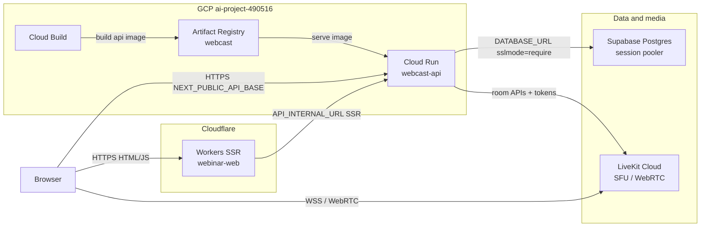
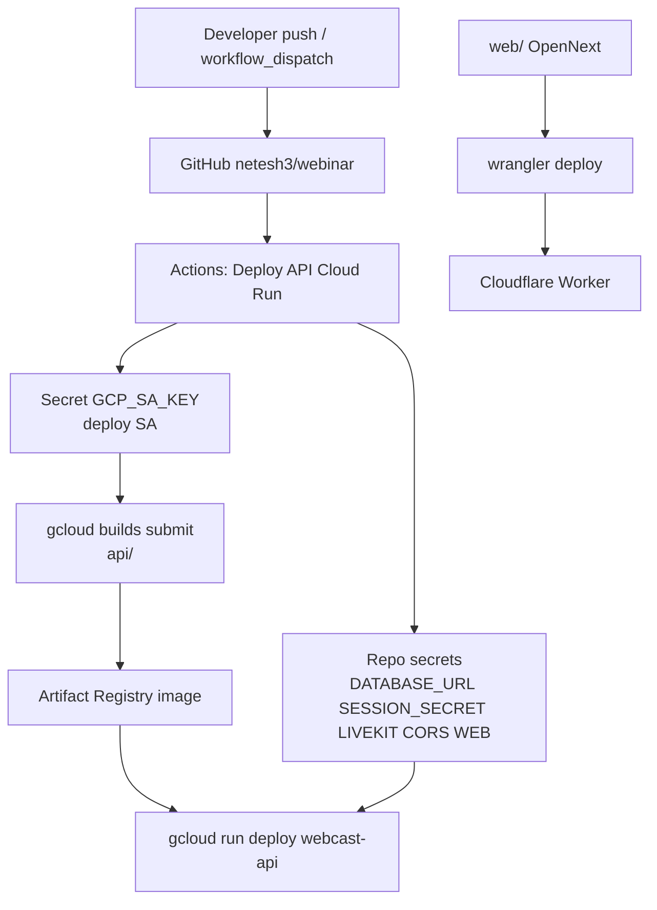

# Deployment topology (managed cloud)

This is the **current production-shaped** deployment: managed frontend, API, database, and SFU. It is separate from the single-server Docker stack in [`DEPLOY.md`](../DEPLOY.md) / [`DEPLOY-ANYWHERE.md`](../DEPLOY-ANYWHERE.md) and from the path-mounted Kubernetes sketch in [`k8s/README.md`](../k8s/README.md).

| Layer | Where it runs | Public URL / endpoint |
|---|---|---|
| Frontend (Next.js 16 via OpenNext) | Cloudflare Workers | https://webinar-web.ganesh-s-p006.workers.dev |
| API (Go) | Google Cloud Run · `us-central1` | https://webcast-api-514730520122.us-central1.run.app |
| Postgres | Supabase · project `webcast` (`qiakwcylllwwvjymgmtz`) · `us-east-1` | session pooler `:5432` + `sslmode=require` |
| Media SFU | LiveKit Cloud | `wss://webinar-34dvh60a.livekit.cloud` |
| Images | Artifact Registry · `webcast` · `us-central1` | `us-central1-docker.pkg.dev/ai-project-490516/webcast/…` |
| CI / deploy | GitHub Actions → Cloud Build → Cloud Run | [`.github/workflows/cloudrun-deploy.yml`](../.github/workflows/cloudrun-deploy.yml) |

GCP project: **`ai-project-490516`**. Deploy SA: `webcast-deploy@ai-project-490516.iam.gserviceaccount.com` (JSON key stored as GitHub secret `GCP_SA_KEY`).

---

## Runtime topology

**Request paths**

1. **Page load / SSR** — browser → Cloudflare Worker → (optional) Go API via `API_INTERNAL_URL`.
2. **Browser API calls** — browser → Go API (`NEXT_PUBLIC_API_BASE` = Cloud Run URL). CORS allows the Workers origin.
3. **Media** — browser ↔ LiveKit Cloud directly (API only mints JWTs and calls room APIs; media UDP/TCP never goes through Cloud Run).

Health check on the API: **`GET /readyz`** (prefer this over `/healthz` on Cloud Run).

---

## Deploy / CI topology

| Trigger | What deploys |
|---|---|
| Push to `main` changing `api/**`, deploy script, or the workflow | API → Cloud Run (auto) |
| Actions → **Deploy API (Cloud Run)** → Run workflow | API → Cloud Run (manual) |
| `cd web && npm run deploy` (OpenNext) | Frontend → Cloudflare Workers (manual today) |

Required GitHub **secrets**: `GCP_SA_KEY`, `DATABASE_URL`, `SESSION_SECRET`, `LIVEKIT_URL`, `LIVEKIT_API_KEY`, `LIVEKIT_API_SECRET` (or `LIVEKIT_PROJECTS`).  
Optional: `CORS_ORIGINS`, `WEB_BASE_URL`, `ADMIN_EMAILS` / `ADMIN_PASSWORD` (bootstrap production admin on fresh DB).  
Repo **variables**: `GCP_PROJECT`, `GCP_REGION`.

Local mirror of env (gitignored): [`deploy/cloudrun.env`](../deploy/cloudrun.env.example). Supabase notes: [`deploy/SUPABASE.md`](../deploy/SUPABASE.md). Frontend Worker notes: [`web/CLOUDFLARE.md`](../web/CLOUDFLARE.md).

---

## Trust boundaries and what each piece owns

| Component | Owns | Does not own |
|---|---|---|
| Cloudflare Worker | HTML/SSR, static assets, edge routing | WebRTC media; durable DB |
| Cloud Run API | Auth sessions, webinar state, LiveKit tokens, chat/polls APIs | Media forwarding; long-lived disk recordings (disabled: `RECORDINGS_ENABLED=false`) |
| Supabase | Postgres schema + data; migrations applied on API boot / `make migrate` | Application logic |
| LiveKit Cloud | Rooms, tracks, attendee `Hidden` / publish permissions | Business roles (those come from API JWTs + DB) |

---

## Environment shape on Cloud Run

| Variable | Role |
|---|---|
| `APP_ENV=production` | Strict secrets, secure cookies |
| `SEED_DEV=false` | No demo users |
| `RECORDINGS_ENABLED=false` | No writable disk volume on Cloud Run |
| `DATABASE_URL` | Supabase **session pooler** URI (`sslmode=require`); direct `db.*` may be IPv6-only |
| `SESSION_SECRET` | ≥32 bytes |
| `LIVEKIT_*` | Legacy trio → one LiveKit Cloud project |
| `CORS_ORIGINS` / `WEB_BASE_URL` | Frontend origin (Workers URL today) |
| `ADMIN_EMAILS` / `ADMIN_PASSWORD` | Bootstrap admin at API boot (≥10 chars); GitHub secrets → Cloud Run env |

**Admin bootstrap:** set `ADMIN_EMAILS` + `ADMIN_PASSWORD` (≥10 chars) as GitHub secrets (or in `deploy/cloudrun.env`) and redeploy so `EnsureAdminAccount` / `PromoteAdmins` run. Production does not ship seeded `webcast-dev` accounts.

**Budget:** GCP project has a monthly billing budget (₹1,500 thresholds). No Cloud Run Monitoring alert policies yet.

---

## Related docs

| Doc | Scope |
|---|---|
| [`ARCHITECTURE.md`](../ARCHITECTURE.md) | Product/runtime behaviour (roles, SFU, API) |
| [`DEPLOY.md`](../DEPLOY.md) / [`DEPLOY-ANYWHERE.md`](../DEPLOY-ANYWHERE.md) | Self-hosted single VM + LiveKit on the box |
| [`docs/CAPACITY.md`](CAPACITY.md) | Sizing / 500-attendee assumptions |
| [`deploy/SUPABASE.md`](../deploy/SUPABASE.md) | Managed Postgres for this topology |
| [`web/CLOUDFLARE.md`](../web/CLOUDFLARE.md) | OpenNext / Workers deploy |
