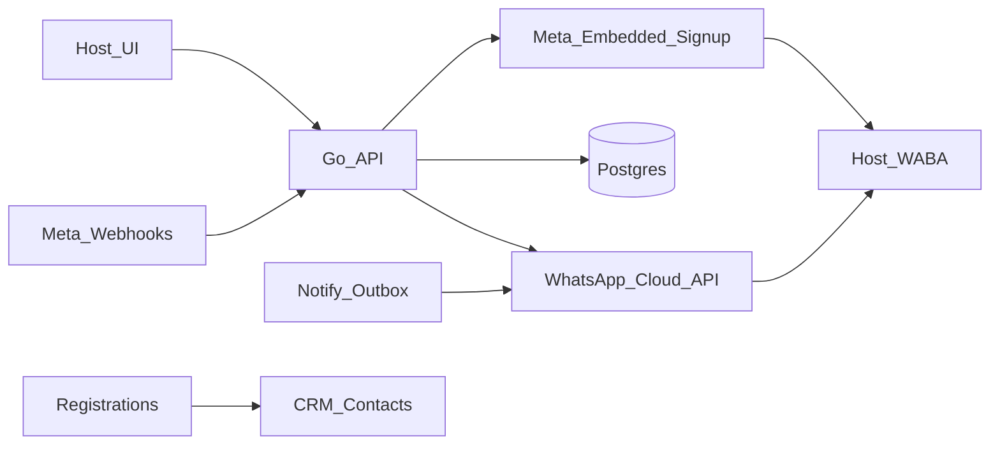

# Connect WhatsApp + Marketing CRM

Working copy of the program plan, kept in the repo so the phases and the code
can be read next to each other. Originally drafted outside it
(`~/.cursor/plans/whatsapp_crm_webcast_76acbc71.plan.md`); this file is now the
one to edit.

## Where this stands

| Phase | Scope | Status |
| --- | --- | --- |
| 1a | Embedded Signup, `users` WA columns, connect/disconnect API + Account UI | **done** — see below |
| 1b | `crm_contacts`/`crm_messages`, registration upsert, opt-in, webhook ingest, Contacts + Inbox UI | **done** — see below |
| 1c | Template cache, send template, outbox WA reminders tied to the schedule toggle | **done** — see below |
| 2 | Broadcasts: audience + scheduled template sends + stats | **done** — see below |
| 3 | Drips: builder, enrollments, sweeper-driven steps | **done** — see below |
| 4 | Visual bot canvas, runtime, handoff to inbox | **done** — see below |
| 5 | Contact tags + notes, the replay-link email and its WhatsApp copy, number registration, and a per-account switch for each | **done** — see below |

**Phase 1a, as built:**

- `api/internal/wa/` — Graph client: Embedded Signup code exchange, phone-number
  lookup, app subscribe/unsubscribe on a WABA, webhook signature verification,
  and the pinned Graph version the browser SDK is initialised with.
- `api/internal/store/migrations/0041_whatsapp_connect.sql` — the WA columns on
  `users`, alongside the YouTube grant.
- `store.User` WA fields + `SetUserWhatsApp`, `types.WhatsAppLink` on `Account`.
- `config.Config`: `META_APP_ID`, `META_APP_SECRET`, `META_WHATSAPP_CONFIG_ID`,
  `META_WEBHOOK_VERIFY_TOKEN`, `WHATSAPP_GRAPH_URL`, and
  `WhatsAppConnectEnabled()`. Env plumbing through `.env.example`, `start.sh`,
  `deploy/`, and the deploy workflow.
- `api/internal/api/whatsapp.go` + `Server.whatsapp`:
  `GET /api/host/whatsapp/connect` (the signup payload),
  `POST /api/host/whatsapp/callback` (exchange → number → subscribe → store),
  `DELETE /api/host/whatsapp` (unsubscribe → clear), and public
  `GET|POST /api/webhooks/whatsapp` (verify-token handshake, then signature
  check and a 200 — ingest is Phase 1b).
- `web/lib/whatsapp-signup.ts` + `web/components/whatsapp-card.tsx` — the SDK
  dialog and the Account card, gated on `whatsappConnect` and `canHost`.

**Two shapes that differ from the YouTube feature they were modelled on, and
why:**

1. **No redirect, so no state cookie.** Embedded Signup is a JS SDK popup, not an
   OAuth redirect: the code comes back to our own page, which POSTs it to
   `/callback` with the session cookie already proving who is connecting. The
   `wabaId` and `phoneNumberId` arrive separately, by `postMessage`, and both are
   required — a code alone buys a token with nothing to send from.
2. **`/api/config` carries only the flag.** `whatsappConnect` says whether to
   show the card; `metaAppId` and the signup configuration id are served by
   `GET /api/host/whatsapp/connect` to a signed-in host at the moment they click.
   Neither is secret, but neither needs to go to every anonymous visitor at boot.

**What a failure mid-connect does:** the code is single-use, so a failed *number
lookup* or *app subscription* is logged and the grant is still stored — walking a
host through the whole dialog again to re-fetch a display string would be worse
than a missing display string. A rejected token is the exception, because what
would be stored is already useless.

**Deferred from the client:** `POST /{phone-number-id}/register`, which a
number created *during* Embedded Signup needs before Cloud API will send from
it. It takes a two-step-verification PIN, and where that PIN is generated and
stored is a design decision, not a stub. **Built in Phase 5**, and the design
decision went the other way: the PIN is the host's own, typed in the connect flow,
and stored nowhere — see deviations 84 to 86.

**Phase 1b, as built:**

- `api/internal/store/migrations/0042_crm_contacts.sql` — `crm_contacts`
  (host-scoped, partial-unique on phone and on email, `registration_id` with
  `ON DELETE SET NULL`, the two consent timestamps, `last_seen_at`) and
  `crm_messages` (direction, body, `kind`, `wamid` partial-unique per host,
  status, error).
- `api/internal/store/crm.go` — `UpsertContact`, `Contact`, `ContactByPhone`,
  `Contacts` (search + total), `Thread`, `AppendMessage`, `SetMessageStatus`,
  `SetContactWhatsAppOptOut`, `ContactFromRegistration`.
- `api/internal/wa/webhook.go` — `ParseWebhook` over Meta's batched
  `entry[].changes[].value`: messages (text, button, interactive replies, media
  captions, voice notes) and statuses, with Meta's error text carried through.
- `api/internal/api/whatsapp.go` — `ingestWhatsApp`: route by
  `metadata.phone_number_id` → the host who connected it, upsert the contact,
  append the message, apply `STOP`, then apply statuses. Still always 200.
- `api/internal/api/crm.go` — `GET /api/host/crm/contacts`,
  `GET /api/host/crm/contacts/{id}`, `POST /api/host/crm/contacts/{id}/opt-out`.
- `handleRegister` → `contactFromRegistration`, after the registration commits
  and non-fatal, so the CRM can never fail somebody's registration.
- `web/components/crm-screen.tsx` + `web/app/host/(portal)/crm/page.tsx` +
  a **Contacts** entry in the top nav; the WhatsApp opt-in checkbox on
  `web/components/register-form.tsx`.

**Deliberate deviations from the plan's shape, and why:**

1. **No `crm_conversations` table.** A thread is `(host, contact)` and nothing
   else while a host has one number, so a conversation row would carry no fact
   that is not already derivable. Documented in the migration: when a host can
   connect several numbers, the thread stops being derivable and the table
   becomes worth adding.
2. **Opt-in is two timestamps, not a boolean.** `whatsapp_opt_in_at` and
   `whatsapp_opt_out_at`; `whatsappOptIn` on the wire is computed from them. A
   boolean cannot answer "when did they refuse", which is the only form in which
   a refusal is provable.
3. **An inbound message is not consent.** It opens Meta's 24-hour service window
   and nothing more, so ingest never sets an opt-in — and a WhatsApp profile name
   fills a blank but never overwrites a name a registration form collected
   (`ContactInput.Weak`).
4. **No opt-IN endpoint.** The one CRM write is the opt-out. Consent has to come
   from the person, not from the party who benefits from having it.
5. **`STOP` is matched as a bare word only** ("STOP", "UNSUBSCRIBE", "STOP ALL",
   "OPT OUT", trimmed of `.!`), never as a substring: "please stop sending the
   9am one" is a request to a human.
6. **No compose box in 1b.** The Inbox said in place of one that replying arrived
   with the template work in 1c, rather than leaving a host hunting for it. It
   now does.

**Tests added:** `api/internal/wa/webhook_test.go` (6: messages + statuses,
Meta's failure text, non-text kinds, payloads to ignore, non-JSON, timestamp
junk) and `api/internal/api/crm_test.go` (6: one contact per registrant however
many times they register; an opt-in with no number is not stored; every read is
scoped to the caller and another host's id is a 404; webhook ingest merges into
the registrant's contact, is idempotent on redelivery, creates new senders, and
drops deliveries for a number nobody connected; `STOP` opts out while the message
is kept; statuses only move forward and `failed` always wins).

Status ordering is asserted against an **inbound** message, because nothing in
that phase could send one — the rank logic is the same either way. 1c gave it a
real send to hang on, and `TestWhatsAppConfirmationOnRegistration` now walks a
delivery webhook over an outbound row as well.

**Phase 1c, as built:**

- `api/internal/store/migrations/0043_crm_templates.sql` — `crm_templates`, a
  cache of what Meta last said about a host's templates: `(host, name, language)`
  identity, Meta's `status`/`category` as free text, the header, body and footer,
  the parsed `{{n}}` count, and `unsupported` — empty when the template can be
  sent from here, otherwise the reason it cannot.
- `api/internal/store/migrations/0044_whatsapp_reminders.sql` — `channel`,
  `contact_id`, `template_name`, `template_language`, `template_params` on
  `notifications`, the three `wa_*` kinds, a one-per-kind-per-registration unique
  index, a partial index for the WhatsApp sweep, and `crm_reminder_templates`
  (`host_id`, `kind`, name, language, param tokens).
- `api/internal/wa/send.go` — `Templates` (list + parse components into body,
  header, footer, param count), `SendTemplate`, `SendText`, `Render` (fills
  `{{n}}` locally so a sent message can be stored as text), and Meta's error
  text carried through on failure.
- `api/internal/store/crm_templates.go` — `ReplaceTemplates` (a sync is a
  replace, in one transaction), `Templates` (+ the last sync time), `Template`.
- `api/internal/store/crm_reminders.go` — `ReminderTemplates`,
  `ReminderTemplate`, `SetReminderTemplates`, and `PendingWhatsApp`, which is the
  WhatsApp half of the outbox sweep: it joins the contact and the host's grant,
  and only returns rows whose registration is `approved` and whose contact is
  opted in and not opted out.
- `api/internal/api/crm.go` — `GET /api/host/crm/templates` (cached, `?refresh=1`
  to re-sync, `syncTemplates` also runs when the cache is empty) and
  `POST /api/host/crm/contacts/{id}/send`, which sends either a template or free
  text and records the message.
- `api/internal/api/crm_reminders.go` — `GET|PUT /api/host/crm/reminders` (the
  host's template per kind, validated against the cache at save time), the
  server-supplied merge fields (`name`, `topic`, `when`, `host`),
  `enqueueWhatsAppInvite` on the registration path, and `flushWhatsAppOutbox`,
  called from the registration path, the approval path, and the 30-second
  sweeper beside `flushOutbox`.
- `web/lib/api.ts` — `crmTemplates`, `crmSend`, `crmReminders`,
  `setCrmReminders`.
- `web/components/crm-screen.tsx` — the compose box on a thread (template picker
  with per-`{{n}}` inputs and a live preview, or free text while the 24-hour
  window is open, with the reason stated when it is not) and an "Automatic
  WhatsApp messages" disclosure for the three reminder kinds.
- `web/components/schedule-form.tsx` — the **WhatsApp reminders** toggle, off by
  default, disabled with a link to Account until WhatsApp is connected;
  `web/components/host-webinar-tabs.tsx` shows it on the Settings tab.

**Deliberate deviations added in 1c, and why:**

7. **A separate `crm_templates` cache, not `whatsapp_templates` on the host.**
   Meta owns these rows and nothing in the product edits them — a sync replaces
   them wholesale. The cache exists because Meta rate-limits template reads per
   WABA, and a 3am reminder that fails because a *list* call was throttled would
   be absurd.
8. **`status` and `category` are text, not enums, and "can't send this" is a
   sentence, not a boolean.** Meta has added states before (`PAUSED`,
   `IN_APPEAL`); an unknown one should surface in the UI as itself rather than
   abort a sync. `unsupported` holds the reason in words a host can read ("its
   header is image"), because a template greyed out with no explanation is a
   support ticket — and a template that becomes sendable when the code grows
   media-header support says so after the next refresh.
9. **Opt-out outranks the template category.** A UTILITY template is
   transactional and Meta permits it without marketing consent, but an opt-out in
   our CRM stops everything: it is the only instruction the person actually gave
   us.
10. **Free-form inside the 24-hour window needs no opt-in.** The window is opened
    by the contact writing in, which is consent to be answered — requiring a
    marketing opt-in to reply to a question would make the inbox useless. A
    MARKETING template still needs `whatsapp_opt_in_at`.
11. **Send first, record second.** `SendTemplate` runs, then the outbox row is
    marked and `crm_messages` is appended. A crash between the two loses a record
    of a message that was sent; the other order risks sending twice, and Meta
    charges the host for the second one.
12. **Ownership is checked before connection.** Another host's contact id is a
    404 even when the caller has no WhatsApp grant at all, so the error can never
    be used to probe for contacts.
13. **One extended outbox rather than a second queue.** A WhatsApp reminder is
    the same fact as an email reminder with a different transport, so `due_at`,
    `attempts`, the backoff and the reschedule-on-move behaviour are already
    right for it. Reasoned out in full at the top of `0044`.
14. **`options.whatsappReminders` defaults to false and gates the confirmation
    too.** Email reminders default on because the address was typed into our own
    form; a WhatsApp message costs the host money on Meta's bill, so somebody has
    to ask for it. And a host who does not want a 1h reminder is unlikely to want
    an unasked-for confirmation either — one toggle, all three messages.
15. **Automatic reminders require opt-in even for UTILITY.** Stricter than the
    manual send path on purpose: a host clicking Send has just read the
    conversation, whereas a scheduled job has nobody watching, and "we sent it at
    3am because the template was transactional" is not an answer to a complaint.
16. **Merge fields are a fixed server-supplied set, resolved at enqueue time.**
    A host maps each `{{n}}` to one of `name`, `topic`, `when`, `host` — not free
    text. Resolving at enqueue makes the row a record of what was promised, so a
    webinar renamed an hour before it starts cannot rewrite a composed reminder.
17. **`wa_replay` is deferred.** The kind is in the plan, but nothing in the
    codebase sends a replay link yet — not for email either — so there is no
    trigger to hang it on. Adding the kind without the trigger would be a column
    value no code can produce. **Closed in Phase 5**, in that order: the email
    trigger first — publishing a recording — and then `wa_replay` on top of it.

**A pre-existing bug this phase surfaced:** `RescheduleRemindersForWebinar` had
always failed with `SQLSTATE 42804`. Postgres inferred `$2`'s type from
`$2 - interval '24 hours'`, decided it was an interval, and rejected the
statement — which `host.go` logged as a warning and carried on from, so moving a
webinar quietly left its reminders at the old times. Fixed with `$2::timestamptz`
in every `CASE` branch.

**Tests added:** `api/internal/wa/send_test.go` (9: the template and text request
bodies Graph actually receives, an incomplete send and a template read with no
token or WABA both refused before the call, a 200 with no message id treated as a
failure, Meta's error text, component parsing, paging over a long template list,
and `Render`),
`api/internal/api/crm_send_test.go` (5: templates are cached and
`?refresh=1` re-syncs; a template send records the message and renders the body;
a table of refusals — not connected, no number, opted out, empty, no such
template, not approved, wrong param count, MARKETING without opt-in; free text
needs the service window; Meta's own rejection reason reaches the host) and
`api/internal/api/crm_reminders_test.go` (5: the settings round-trip and its
refusals; a confirmation actually sent on registration, its delivery status, and
the two timed rows left owing; any one of the three switches off sending nothing
and queueing nothing; a manual-approval seat that waits, and whose row is retired if
Meta loses the template before approval; a reminder stopped by an opt-out, and
settings kept across a disconnect).

**Phase 2, as built:**

- `api/internal/store/migrations/0045_whatsapp_broadcasts.sql` — `crm_broadcasts`
  (host, label, template name + language, the unresolved `params`, the audience
  with a `CHECK`, `webinar_id` `SET NULL`, `scheduled_at`, `canceled_at` and
  nothing else about status), the `wa_broadcast` kind and `broadcast_id` on
  `notifications` with a `(kind = 'wa_broadcast') = (broadcast_id IS NOT NULL)`
  constraint, one-per-person-per-broadcast unique index, and `broadcast_id` on
  `crm_messages` so delivered/read can be counted from the conversation.
- `api/internal/store/crm_broadcasts.go` — `audienceFrom` (the FROM/WHERE for an
  audience, once, so the preview and the send can never disagree), `reachable`
  (opted in, not opted out, has a number), `AudienceCounts`, `AudienceContacts`,
  `CreateBroadcast` (the broadcast row and every recipient's queued message in one
  transaction), `Broadcasts`, `Broadcast`, `CancelBroadcast`, and `scanBroadcast`,
  which derives the status and the stats from the outbox rows and the messages.
- `api/internal/api/crm_broadcasts.go` — `GET /api/host/crm/audience`,
  `GET|POST /api/host/crm/broadcasts`, `GET /api/host/crm/broadcasts/{id}`,
  `POST /api/host/crm/broadcasts/{id}/cancel`; `audienceAllowed` (another host's
  webinar and a missing one are the same refusal), `paramsAllowed`, and
  `resolveBroadcastParams`, which renders each recipient's values at create time.
- The send path is the one that already existed: recipients are `notifications`
  rows, so `PendingWhatsApp` re-checks consent, `flushWhatsAppOutbox` sends them
  100 at a time, `RecordSendAttempt` backs off, and the stored `crm_messages` row
  carries the `broadcast_id` the webhook stats are read from.
- `web/lib/api.ts` — `crmAudience`, `crmBroadcasts`, `crmBroadcast`,
  `createCrmBroadcast`, `cancelCrmBroadcast`.
- `web/components/crm-templates.tsx` — the template pieces that three screens now
  share (`templateKey`, `renderTemplate`, `defaultTokens`, `exampleFor`,
  `RefreshTemplates`, `BlockedList`), moved out of `crm-screen.tsx` so the
  broadcast composer can use them without importing the screen that imports it.
- `web/components/crm-broadcasts.tsx` — the list with a status badge and the stats
  per row, and the composer: audience, webinar, template, one row per `{{n}}`
  (merge field or the same words for everybody), a live preview of the message and
  of the audience size, "send now" or a scheduled time in the host's own zone, and
  cancel behind a confirm. Polled only while something is in flight.
- `web/components/crm-screen.tsx` — a `Contacts` / `Broadcasts` tab pair under the
  header, since both halves of the CRM are the same list seen two ways.

**Deliberate deviations added in 2, and why:**

18. **Recipients are outbox rows, not a `crm_broadcast_recipients` table.** Every
    property a recipient row needs — due time, attempts, backoff, consent
    re-checked at send, a `crm_messages` row on success — is what `notifications`
    already does for reminders. A second table would be a second answer to "was
    this person told".
19. **Status is derived, never stored.** Scheduled, sending and sent are facts
    about the queued messages; storing them again would produce the usual
    disagreement — a row saying "sent" while three messages are still pending
    because Meta was rate-limiting. `canceled_at` is stored precisely because it
    is the one thing a host *did* that the outbox does not record.
20. **The audience is frozen when the broadcast is created.** The count beside the
    send button is the number of people who will be messaged, because those rows
    exist by the time the response comes back. A broadcast that re-resolved its
    audience at send time would message people who were not in the list the host
    approved.
21. **A broadcast requires opt-in whatever the template's category is.** Meta
    permits a UTILITY template without marketing consent, and a broadcast is still
    the host's own message at a moment they chose rather than a receipt for
    anything the recipient did. The category changes the price, not the audience.
22. **No drafts and no `PATCH`.** The recipients are queued the moment the
    broadcast exists, so there is nothing an edit could mean; the only change left
    is cancel. A draft is a message nobody has decided to send, and there is
    nothing worth keeping about one.
23. **Broadcast rows keep `webinar_id` NULL on the notification.** The reminder
    sweeps reschedule and skip rows by webinar, and a webinar moved to Friday must
    not move a broadcast the host scheduled for Tuesday. The broadcast's own row
    holds the webinar it is about.
24. **Registrants are matched on digits, email or registration id, with declined
    excluded and pending included.** A registration is not a contact — the same
    person may have registered by email and then written in from their phone — so
    all three are tried. Pending seats are in, because the broadcast is queued and
    consent is checked again when it goes out.
25. **5000 recipients is a refusal, not a page.** `maxBroadcastRecipients`
    refuses with `crm_audience_too_large` rather than silently messaging the first
    5000 of a bigger list. Spending a host's Meta credit on a partial send nobody
    asked for is worse than making them say so.
26. **A scheduled time in the past means now.** "Send now" posts no time at all,
    and a time that has just passed is the same instruction. The browser still
    refuses to *offer* a past time, so the only way to reach this is a clock that
    moved.
27. **Cancel is 422 once there is nothing left to stop.** `crm_broadcast_done` for
    a broadcast already sent or already cancelled, rather than a 200 that reads as
    "cancelled" about messages that are on people's phones.
28. **An empty audience is refused, not created.** `crm_audience_empty`, because a
    broadcast with no recipients would sit in the list looking like it worked.

**Tests added:** `api/internal/api/crm_broadcasts_test.go` (6: the four exclusion
buckets counted for both audiences and five refusals of a bad audience; a
broadcast queued, then drained, with the per-recipient bodies rendered from the
merge fields and delivered/read arriving by webhook — and nothing sent from the
create request itself; consent re-checked at send, so a recipient who opts out
afterwards stays queued and unsent; cancel retiring what is left and refusing the
second time; a 12-row refusals table; and host scoping, where another host's
broadcast is a 404 to both read and cancel). `drainWhatsAppOutbox` stands in for
the 30-second sweeper by registering a throwaway email-only registrant, since a
registration flushes the WhatsApp outbox synchronously.

**Phase 3, as built:**

- `api/internal/store/migrations/0046_whatsapp_drips.sql` — three tables, and the
  split is the design: `crm_drips` (host, name, `trigger_kind` with a `CHECK`,
  optional `webinar_id` `ON DELETE CASCADE`, `active`) is the rule; `crm_drip_steps`
  (`(drip_id, position)` primary key, `delay_minutes` relative to the step before,
  template name + language, unresolved `params`) is what it sends; and
  `crm_drip_enrollments` (drip, contact, the webinar they entered from, `position`,
  `state`, `exit_reason`, `next_due_at`) is one person's place in it. Plus the
  `wa_drip` kind and `drip_enrollment_id` on `notifications`, with the same
  `(kind = 'wa_drip') = (drip_enrollment_id IS NOT NULL)` shape constraint the
  broadcasts use, and a unique index making one enrollment per person per sequence.
- `api/internal/store/crm_drips.go` — `SaveDrip` (the drip and all its steps in one
  transaction; the steps are deleted and rewritten, so a sequence read back is the
  sequence that was sent), `Drips`/`Drip` with the counts as scalar subqueries,
  `DeleteDrip`, the shared `enrollSelect` behind `EnrollOnRegistration`,
  `EnrollOnWebinarEnd` (the `attended`/`no_show` split, matched through the
  registration) and `EnrollByHand`, `DripEnrollments`, `ExitDripEnrollment`,
  `exitDripsForContact`, `DueDripSteps` and `QueueDripStep`.
- `contactMatchesRegistration` in `crm_broadcasts.go` — the registration-id / email
  / digits match, now shared by the audience query and the webinar triggers, since
  "did this contact register" had to mean the same thing in both.
- `api/internal/api/crm_drips.go` — `GET|POST /api/host/crm/drips`,
  `GET|PUT|DELETE /api/host/crm/drips/{id}`,
  `POST /api/host/crm/drips/{id}/enrollments`,
  `DELETE /api/host/crm/drips/{id}/enrollments/{enrollmentId}`; `stepsAllowed`,
  which checks every step's template, parameter count and merge fields before
  anything is written; the `enrollDripsOnRegistration` and
  `enrollDripsOnWebinarEnd` triggers; and `AdvanceDrips`, the sweep.
- `api/internal/api/sweeper.go` — `AdvanceDrips` runs between `flushOutbox` and
  `flushWhatsAppOutbox`, so a step that came due in the last thirty seconds goes out
  on the same tick it was queued on.
- `api/internal/api/webinars.go` and `host.go` — the two trigger call sites. The
  webinar one is in `endWebinarSession` rather than `handleEndWebinar`, so the
  meeting-limit and empty-room sweepers enrol the same people as a host pressing
  End, and it is after the room is gone so attendance is final.
- `api/internal/store/crm.go` — `SetContactWhatsAppOptOut` is now a transaction that
  also exits the contact's sequences, which is what makes a "STOP" reply stop them.
- `api/internal/store/crm_reminders.go` — one more clause in `PendingWhatsApp`: a
  drip row only sends while its sequence is active and its enrollment is not exited.
- `web/lib/api.ts` — `crmDrips`, `crmDrip`, `createCrmDrip`, `updateCrmDrip`,
  `deleteCrmDrip`, `enrollCrmDrip`, `removeCrmDripEnrollment`.
- `web/components/crm-drips.tsx` — the list (trigger, running/paused, the steps as a
  timeline, the people counts and the message counts), the builder (entry rule,
  webinar, a step editor whose wait is a number and a unit, per-`{{n}}` merge fields
  with a live preview, and the run switch), and the people pane: where each person is,
  why anybody stopped early, adding somebody by hand and taking them off again.
- `web/components/crm-screen.tsx` — a third tab, **Sequences**.

**Deliberate deviations added in 3, and why:**

29. **Free-form steps were dropped.** The plan offered "delay + template, or
    free-form inside the 24h window". A step is due days after the previous one, so
    by construction it is outside the window a contact's own message opened — the
    feature would have been an option that fails whenever it is used. Free text
    stays where it belongs, in the inbox, where a host is answering somebody.
30. **"Tag added" is not a trigger.** Contacts still have no tags (the same gap that
    keeps tags out of the broadcast audience), so the trigger would have been a
    `trigger_kind` value nothing could ever fire. The five that exist are `manual`,
    `registered`, `attended`, `no_show` and `ended`.
31. **`no_show` and `ended` are triggers, and both fire when a webinar ends.**
    "Sorry you missed it" is the most obviously useful sequence in the feature, and
    it is the exact complement of "thanks for coming"; sorting the registrants once,
    at the moment attendance stops changing, is cheaper and less ambiguous than
    asking each sequence to work it out later.
32. **One enrollment per person per sequence, enforced by a unique index.** The
    `registered` trigger fires on every registration, so without it a lead who signs
    up for two webinars gets the whole sequence twice — and the host pays for it. A
    finished enrollment keeps its row precisely because it is the record that this
    person has already been through this.
33. **An exit is a marked row, never a deleted one.** Deleting would let the next
    trigger put the same person straight back on, which is not what "they opted out"
    or "the host removed them" means. The reason is stored — the one thing about a
    sequence that the outbox cannot reconstruct.
34. **Steps are queued one at a time, as they come due.** Queueing the whole
    sequence at entry would fix five messages' worth of merge values days in advance
    and make an opt-out a race against rows already in the outbox. It also means a
    step's values are resolved from the webinar as it is when the step goes, which is
    the reminder rule too.
35. **Queue and advance are one transaction, guarded by `position`.** Two sweeps
    running at once (a redeploy, two instances) both see the same due row; the
    `WHERE position = $2` on the advance means the loser's queue is rolled back
    rather than sending a duplicate. That is also why there is no unique index per
    step.
36. **A paused sequence holds its queued step rather than skipping it.**
    `PendingWhatsApp` tests `state <> 'exited'` and `d.active`, so pausing stops
    everything without losing anybody's place, and resuming sends the held step.
    `state <> 'exited'` rather than `= 'active'` on purpose: the last step of a
    just-finished enrollment still has to go.
37. **Drip notification rows keep `webinar_id` NULL.** The same reasoning as
    deviation 23, with a sharper consequence: the reminder sweeps skip rows whose
    webinar has ended, and a follow-up sequence exists *because* the webinar ended.
    The enrollment carries the webinar instead.
38. **`crm_drips.webinar_id` cascades; `crm_drip_enrollments.webinar_id` sets null.**
    A deleted webinar must not silently widen "this one webinar" to "every webinar",
    which is what `SET NULL` on the rule would do. An enrollment is different: its
    steps' values are resolved as they are queued, and a sequence already running for
    somebody should not stop because last month's webinar was tidied away.
39. **Webinar-triggered enrolment honours `options.whatsappReminders`.** One switch
    means "nothing on WhatsApp about this webinar", not "nothing except the
    sequence". Adding somebody by hand is not gated, because that is the host acting
    rather than the webinar's settings applying.
40. **A new sequence is created paused unless the request says otherwise.** `active`
    absent is false, and the builder's switch starts off: an active `registered`
    sequence starts messaging whoever signs up next, and the host has not read it
    back yet.
41. **Editing a running sequence is allowed, and says so.** A drip is a rule, and
    the alternative — clone-and-retire — would leave people mid-sequence on a version
    the host can no longer see. What it costs is that step positions move, so the
    builder says as much above the steps whenever anybody is part-way through.
42. **`AdvanceDrips` is exported.** Every other sweep can be provoked through a
    request (a registration flushes the outbox), and nothing at all makes a sequence
    advance except time passing — so the tests need a way in that is not a
    `time.Sleep`.

**Tests added:** `api/internal/api/crm_drips_test.go` (7: an 11-row builder refusals
table, each asserting nothing reached Meta, plus the positive cases that prove the
webinar merge fields are about having a webinar rather than having a slug; a
registrant taken through a two-step sequence, with each message resolved into their
own thread, the `done` state, a third sweep that sends nothing and a second
registration that does not start them again; a "STOP" reply through the webhook
exiting the enrollment with its reason and retiring the rest; pause holding a due
step and resume sending it; manual enrolment, the 422 for a second attempt and for
somebody who never opted in, removal retiring the waiting step, and another host
getting a 404 from all five endpoints; a webinar ending and sorting its registrants
into the `attended`, `no_show` and `ended` sequences, then ending again without
enrolling anybody twice; and a step with a real delay that is not sent early,
alongside a deleted sequence that sends nothing). `runDrips` is one sweeper tick —
`AdvanceDrips` then `drainWhatsAppOutbox` — and the steps wait zero minutes, so one
tick is one step and no test has to fake a clock.

**Phase 4, as built:**

- `api/internal/store/migrations/0047_whatsapp_bots.sql` — three tables and two
  columns. `crm_bots` (host, name, `trigger_kind` with a `CHECK` over `any_message`
  and `keyword`, `keywords text[]`, `entry_key`, `active`) is the rule that starts a
  conversation, with a unique partial index — `WHERE active AND trigger_kind =
  'any_message'` — allowing one catch-all per host. `crm_bot_nodes` is the flow,
  keyed `(bot_id, key)` so every edge is a name the builder generated: `kind` with a
  `CHECK` over the five, `text`, `options jsonb` for an `ask`'s buttons, `next_key`,
  `delay_minutes` between 0 and 1440, `drip_id` `ON DELETE SET NULL`, and `position`
  for the builder's order. `crm_bot_sessions` is one person's trip through one flow
  (`state`, `ended_reason`, `node_key`, `resume_at`, `last_wamid`, `steps`), with a
  unique partial index over `contact_id WHERE state IN ('waiting','sleeping')` so a
  contact is only ever in one live conversation. Then `crm_contacts.bot_paused_at` —
  the handoff — and `crm_messages.bot_id`, which is how a thread says which half of
  it the host did not write.
- `api/internal/store/crm_bots.go` — `SaveBot` (the bot and all its nodes in one
  transaction; the nodes are deleted and rewritten, so a flow read back is the flow
  that runs), `Bots`/`Bot` with the session counts as scalar subqueries, `DeleteBot`,
  `BotSequences` (what an `enroll` node may point at), `BotSessions`,
  `BotForMessage` (the keyword match, then the catch-all), `StartBotSession`,
  `LatestBotSession`, `BotNodes`, `SaveBotSession`, `DueBotSessions`,
  `SetContactBotPaused` and `stopBotsForContact`.
- `api/internal/api/crm_bots.go` — the whole API half: `GET|POST
  /api/host/crm/bots`, `GET|PUT|DELETE /api/host/crm/bots/{id}` and
  `PUT /api/host/crm/contacts/{id}/bot`; `botKeywords` and `flowAllowed`, which
  normalise a flow and refuse the dozen ways it cannot run — including `botCycle`, a
  three-colour walk from the entry; and the runtime, `runBot` → `startBot` /
  `botAnswer` → `runFlow`, with `botSend`, `botEnroll`, `handOffBot`, `saveBotStep`
  and `AdvanceBots`.
- `api/internal/api/whatsapp.go` — one call at the end of `ingestWhatsApp`'s message
  loop, after the STOP branch, which now `continue`s rather than falling through to
  it.
- `api/internal/api/sweeper.go` — `AdvanceBots` after `AdvanceDrips`, which is what
  wakes a `wait` node. Nothing else needs a tick: every other step of a flow runs
  inline, on the webhook request that prompted it.
- `api/internal/store/crm.go` — `SetContactWhatsAppOptOut` also stops the contact's
  live bot sessions, reason `opted_out`, beside the drip exits it already did.
- `web/lib/api.ts` — `crmBots`, `crmBot`, `createCrmBot`, `updateCrmBot`,
  `deleteCrmBot`, `setCrmContactBot`.
- `web/components/crm-bots.tsx` — the list (trigger and keywords,
  answering/paused, the flow as a numbered outline, the conversation counts, and the
  sessions pane saying where each one stopped and why) and the builder: the entry
  rule, a step editor for all five kinds, an edge picker per step that offers the
  other steps by number and by what they say, which step a conversation starts at,
  and the run switch.
- `web/components/crm-screen.tsx` — a fourth tab, **Bots**; the bot's name under an
  outbound bubble it sent; and **Take over from the bot** / **Let the bot answer
  again** in the thread header, offered once a bot has actually spoken there.

**Deliberate deviations added in 4, and why:**

43. **"Set tag" is not a node.** Contacts still have no tags — the same gap that
    keeps them out of the broadcast audience and out of the drip triggers (deviations
    22 and 30) — so the node would have written to a column that does not exist.
    `enroll` covers what it was for: putting somebody on a sequence because of what
    they said.
44. **"Buttons/list" is reply buttons only.** Meta's list message is a second
    interactive shape with its own limits — ten rows, sections, a menu title — and it
    buys nothing this feature needs: the flows a webinar host writes branch three
    ways, which is exactly what `BotMaxButtons` allows. One shape also means one
    answer-matching path, which is deviation 47.
45. **"Condition" is folded into a question's branches.** A condition node needs
    something to condition on, and this runtime has no variables: the only fact a
    flow ever learns is the answer to the question it just asked. That is an `ask`
    with one `next` per button — the same graph, with nothing left to get wrong.
46. **No canvas — the builder is a list of steps.** Every step names the step it goes
    to, so the graph is complete without anybody dragging a line: nothing to store
    for x and y, nothing to lay out on a phone, and the reading order stays the order
    the flow was written in. The outline on the list row is the same information
    without a viewport.
47. **A typed answer is matched against the button labels.** Meta sends a pressed
    button's id back, but plenty of people type "yes" instead of pressing anything,
    and a bot that ignores them is a bot that looks broken. So an answer is matched
    on the id, then on the labels, and only then falls through — which is also why
    two buttons on one question may not say the same thing.
48. **A bot's replies bypass the outbox and send inline.** Everything else in this
    CRM queues, because everything else is a template to somebody who is not there. A
    bot is answering somebody holding their phone: a thirty-second wait for the
    sweeper reads as no answer at all, and the reply is free-form text inside a window
    that is already open, so there is nothing to schedule. A refused send ends the
    session `send_failed` rather than being retried — an answer arriving a minute
    late, out of order, is worse than none.
49. **A bot answers anybody who is not opted out; marketing opt-in is not required.**
    Every other send here needs `whatsapp_opt_in`, because every other send is the
    business starting a conversation. This one is a reply to a message the person
    chose to send, inside their own service window, which is the one case Meta does
    not treat as marketing. An `enroll` node still needs their opt-in — the sequence
    checks that itself — so a flow may enrol somebody who cannot be enrolled, and
    that step is skipped rather than the flow stopped.
50. **One active `any_message` bot per host, enforced by a partial unique index.**
    Two catch-alls would both match every message, and which one answered would be
    whichever the query happened to sort first. The save returns 409
    `crm_bot_catch_all` and says to pause the other one. Keyword bots are unlimited,
    and a keyword match beats the catch-all.
51. **A loop is refused at save time, not merely bounded at run time.** The runtime
    bounds it anyway (deviation 55), but a flow with a loop in it sends dozens of real
    messages to a real person before that fires, on the host's Meta bill. There is no
    variable in a flow to escape a loop with, so a loop is never what somebody drew on
    purpose — better to refuse the drawing.
52. **Handoff is a flag on the contact, not on the session.** "I am dealing with this
    person" has to hold for their next message too, which may arrive after the flow
    they were in has ended. So `crm_contacts.bot_paused_at` is what the runtime
    checks, a handoff node sets it, and the host's toggle in the inbox sets the same
    column with `host_took_over` as the reason.
53. **Handing a conversation back does not reopen the flow it stopped.** Resuming
    clears `bot_paused_at` and nothing else: the session the host took over is
    finished, and the person is answered from the entry the next time they write in.
    Dropping somebody back into the middle of a question they were asked last week is
    worse than starting again.
54. **A flow that sleeps past the service window is stopped, not queued as a
    template.** The plan offered "or queue a template outside it". A template send
    needs an approved template with the right number of placeholders, and a flow's
    words are the host's own, typed into a box — there is nothing to map them to. The
    session ends `window_closed`, which the host can read on the bot's row and fix by
    shortening the wait. It is also why `delay_minutes` is capped at 24 hours.
55. **Every conversation has a step budget, and the budget is a spend limit.**
    `botNodesPerTurn` is 12 and `botNodesPerSession` is 60; a flow past either is
    stopped `too_many_steps`. Each step that speaks is a message on the host's Meta
    bill, and the only thing worse than a bot that stops is a bot that does not.
56. **A redelivered message is compared against `last_wamid` before anything else.**
    Meta retries a webhook it did not get a 200 for, and the retry of the answer that
    *ended* a flow would otherwise find no live session and start the flow over. So
    the latest session is read whatever became of it — `LatestBotSession`, not a live
    one — and its `last_wamid` is checked first.
57. **Somebody who wrote "stop" is never answered by a bot.** The STOP branch of
    `ingestWhatsApp` now `continue`s. Their opt-out already stops their sessions;
    this is about the same request, where a cheerful flowchart asking which department
    they need would be the reply to "stop".
58. **`AdvanceBots` is exported, like `AdvanceDrips`.** Nothing makes a `wait` node
    resume except time passing, and deviation 42's reasoning applies unchanged: the
    tests need a way in that is not a `time.Sleep`.

**Tests added:** `api/internal/api/crm_bots_test.go` (9: a 22-row builder refusals
table — no steps, a blank message, an over-long button, two buttons saying the same
thing, an edge to a step that is not there, a loop, somebody else's sequence, a
25-hour wait and the rest — each asserting that nothing reached Meta, plus a "does
everything" flow saved and read back to prove the keywords were lower-cased and
de-duplicated and that an `enroll` node carries its sequence's name; a conversation
asked, answered by button and run to the end, with the buttons asserted as Meta
received them, the enrolment made, the `wait` parked `sleeping` and finished by
`AdvanceBots`, both outbound messages labelled with the bot's name in the thread, and
a second sweep sending nothing; a redelivered webhook that starts nothing and sends
nothing; a typed answer matched on a button's label, and an unplaceable one handed
over; a handoff pausing every bot for that contact until the host hands it back,
including the host's own `PUT {paused:true}`; a "STOP" reply that is not answered at
all; keyword and catch-all matching, the 409 for a second catch-all, an inactive bot
staying silent, and another host getting a 404 from read, write and delete; a stale
inbound timestamp stopping a flow `window_closed` with zero sends, and a Graph
failure stopping one `send_failed` at the step that failed; and a chain of twenty
messages stopping at exactly twelve sends with `too_many_steps`). Time is not faked
here either — the `wait` nodes wait zero minutes, so one `AdvanceBots` call is one
step — and `justNow` rewrites the shared inbound fixture's 2023 timestamp, since the
service window is a real 24 hours from the contact's own message.

**Phase 5, as built:**

Four things, and they are one phase because each of the first three was a gap the
earlier phases named and left open — the tag audience (deviation 22), the `tag_added`
trigger (30), the `set_tag` node (43), and the replay message with no trigger on any
channel (0044's own comment) — and because the fourth, the per-account switch, is what
makes it safe to ship features that label other people, write to everybody who
registered, and hand a PIN to Meta.

- `api/internal/store/migrations/0048_account_features.sql` — `users.features text[]`
  (absent means off; the valid keys live in `api/types` rather than in a `CHECK`, so the
  API refuses an unknown one before it can be written) and
  `users.whatsapp_registered_at`. There is no column for the PIN anywhere, and the
  migration says why.
- `api/internal/store/migrations/0049_crm_tags_notes.sql` — `crm_tags` (a name and
  nothing else, unique per host case-insensitively), `crm_contact_tags` (a join table
  with a timestamp, because *when* a label went on somebody is part of why they are
  being messaged), `crm_notes` (no `UPDATE` path and no `updated_at`), and then the
  widenings the three earlier phases could not make: the broadcast audience `CHECK` gains
  `tag` plus a `tag_id` with a "needs a tag" constraint, `crm_drips` gains `tag_added`
  and `trigger_tag_id`, `crm_bot_nodes` gains `set_tag` and `tag_id`, and
  `notifications` gains `replay_ready` and `wa_replay` — inside both dedupe indexes —
  alongside `wa_replay` on `crm_reminder_templates`.
- `api/types/types.go` — `FeatureCRMTags`, `FeatureCRMNotes`, `FeatureReplayLinks`,
  `FeatureWhatsAppRegister`; the `Feature` catalogue `types.Features` with the label and
  the sentence explaining each switch, so the admin screen renders what the server
  declares; `KnownFeature`; `FeatureGrant`; `Account.Features` and `AdminUser.Features`;
  `AppConfig.FeatureCatalogue`; `CRMTag`, `CRMNote` and their request/response shapes;
  `WhatsAppRegisterRequest`; `WhatsAppLink.RegisteredAt`; `NotifyReplayReady`,
  `NotifyWhatsAppReplay`; and `CRMMergeField.OnlyKind`.
- `api/internal/api/features.go` — `featureAllowed`, which answers 403 `feature_off`
  naming the switch, and `featureLabel` for that sentence.
- `api/internal/api/admin.go` + `api/internal/store/users.go` —
  `PATCH /api/admin/users/{id}/features` and `store.SetFeature`, returning the account so
  the screen re-renders from the server's own answer rather than from what it asked for.
- `api/internal/store/crm_tags.go` — `Tags` (alphabetical, each with its contact count),
  `CreateTag` (a duplicate answers with the existing tag), `Tag`, `RenameTag`,
  `DeleteTag`, `DripsUsingTag` (for the refusal), `AddContactTag` (reporting whether it
  was new), `RemoveContactTag`, `ContactTags` and `AttachTags` — one query for a whole
  page of contacts, so the list is not N+1.
- `api/internal/api/crm_tags.go` — the six endpoints, `applyTag` as the single place a
  label is put on somebody (and therefore the single place `tag_added` fires, whether the
  host or a bot did it), `crmTagAllowed`, and `hostTags`, which rides along with the
  contacts, broadcasts, sequences and bots responses.
- `api/internal/store/crm_notes.go` + `api/internal/api/crm_notes.go` — `Notes`,
  `AddNote`, `DeleteNote` and the three endpoints. No update anywhere.
- `api/internal/api/crm_broadcasts.go`, `crm_drips.go`, `crm_bots.go` — the three things
  that read a label: the `tag` audience (`?tagId=`, `audienceAllowed`, the frozen
  recipient list), the `tag_added` trigger with `trigger_tag_id` and its "any tag"
  wildcard, and the `set_tag` node in `flowAllowed` and in `runFlow`.
- `api/internal/store/replay.go` — `ReplayRecipients`: the approved registrants of one
  webinar, with the phone and opt-in state beside each address, so both channels are
  decided from one read.
- `api/internal/api/replay.go` — `enqueueReplay`, called from the share handler:
  email to everybody approved, WhatsApp to the subset who also gave a number, opted in,
  and whose host has chosen a template for `wa_replay`. Every failure is logged and
  dropped, because the publish already happened.
- `api/internal/api/recordings.go` — three lines in `handleUpdateRecordingShare`: on the
  way to public, for a recording that is `ready`.
- `api/internal/notify/render.go` + `render_more.go` — `Invite.ReplayURL` and
  `Invite.Passcode`, and `ReplayReady`.
- `api/internal/store/notifications.go` + `api/internal/store/crm_reminders.go` — the two
  queue reads now let the replay past the ended-webinar filter, and the WhatsApp one past
  the per-webinar reminder toggle.
- `api/internal/api/crm_reminders.go` — the `replay` merge field, restricted to
  `wa_replay` by `OnlyKind` and refused elsewhere with a sentence naming the token.
- `api/internal/api/whatsapp.go` — `POST /api/host/whatsapp/register` and `sixDigits`.
  The PIN is validated for shape, handed to Meta, and gone when the request ends.
- `api/internal/wa/` — `Register`, one Graph call.
- `web/lib/api.ts` — `setUserFeature`, `registerWhatsAppNumber`, the nine tag and note
  calls, and `crmAudience`'s third argument.
- `web/components/admin-screen.tsx` — `AccountFeatures`: a folded group of switches per
  hosting account, rendered from `config.featureCatalogue`, reporting the server's
  returned list back into the row.
- `web/components/whatsapp-card.tsx` — `RegisterNumber`: the six-digit field, cleared
  before anything else happens on success, with `autoComplete="off"` rather than
  `one-time-code`.
- `web/components/crm-tags.tsx` (new) — `TagChips` for a contact row, `ContactTags` for
  the open conversation, `TagManager` for creating, renaming and deleting.
- `web/components/crm-notes.tsx` (new) — `NotesPane`, beside the compose box, which says
  out loud that nothing in it is ever sent.
- `web/components/crm-screen.tsx` — the tag state that arrives with the contacts, the
  folded **Tags** card, the chips on every row, the picker in the thread header, the
  notes pane, and the replay row in the reminder settings with the merge-field list
  filtered by `onlyKind`.
- `web/components/crm-broadcasts.tsx`, `crm-drips.tsx`, `crm-bots.tsx` — the audience,
  the trigger and the step, each with a picker of what exists rather than a text box.
- `web/components/recordings-tab.tsx` — the sentence before **Save** saying that
  publishing emails everybody who registered, shown only while the recording is still
  private.

**Deliberate deviations added in 5, and why:**

59. **A feature is a key in a `text[]`, not a boolean column.** `can_host` and
    `can_cdn_broadcast` are columns because they are part of what an account *is*, and
    there are two of them. These are switches on pieces of one product area and the list
    grows every phase: as columns, the twelfth would still cost a migration, a scan list,
    an endpoint field and a toggle. The cost paid instead is that the database no longer
    enumerates the valid values, so the API refuses an unknown key before it is written.
60. **Nothing defaults to on, and there is no "on for everybody" escape hatch.** Every
    switch here either spends the host's money or writes to other people's phones, so an
    administrator turning one on is the record that a person decided to. A host who
    upgrades sees no new buttons until somebody presses one in the admin screen.
61. **The catalogue is the server's, labels and all.** `types.Features` carries the key,
    the name and the sentence explaining it, and `AppConfig.featureCatalogue` ships it to
    the admin screen. The browser keeping its own copy would mean two descriptions of one
    switch, and the wrong one would be the one an administrator read.
62. **A switched-off feature is refused by the API *and* hidden in the UI.** The 403
    `feature_off` is the enforcement; hiding the pane is a kindness, not a permission.
    Both, because a screen whose every button errors is worse than an absent screen, and
    a hidden screen with a live endpoint behind it is not a switch at all.
63. **Turning a switch off never deletes anything.** The tables exist for every host
    whatever their features say, so tags and notes written under a switch survive it
    being turned off and are all still there when it is turned back on. Tested.
64. **A duplicate tag name answers with the existing tag, 200, not a 409.** "VIP" and
    "vip" are one label — case-insensitively unique, since two tags that read the same on
    screen make every audience a coin toss — and asking for a label that is already there
    is not a mistake to report.
65. **Renaming is offered; merging is not.** Two labels becoming one has consequences for
    every audience and every trigger that names either, so a rename onto an existing name
    is refused rather than quietly combined.
66. **`crm_drips.trigger_tag_id` is `ON DELETE RESTRICT`, and the wildcard is the
    reason.** `NULL` there means "any tag", so `SET NULL` on a deleted tag would not break
    the rule — it would silently widen it from one label to every label and start
    messaging people the host never meant. `CASCADE` would be worse: it would delete a
    running sequence and everybody's place on it. So a tag cannot be deleted while a
    sequence names it, and the refusal names the sequence.
67. **`crm_broadcasts.tag_id` is `RESTRICT` too, to keep the record honest.** A broadcast
    is what *was* sent; `NULL` is the shape of every other audience, so "sent to VIP"
    becoming "sent to everybody who opted in" would rewrite history rather than lose a
    detail of it.
68. **`crm_bot_nodes.tag_id` is `SET NULL`, matching `drip_id` on the same table.**
    Deleting a tag must not delete a step out of the middle of a running flow. The node
    survives with nothing to apply, the runtime steps over it, and the builder shows it as
    broken — which is the state the host is actually in.
69. **Applying a tag is idempotent, and only a *new* one starts a sequence.**
    `AddContactTag` reports whether the row was inserted, and `tag_added` fires on that
    alone. A host clicking the same tag twice, or a bot re-running a `set_tag` step, is not
    a reason to put somebody through a sequence again.
70. **Removing a tag fires nothing.** There is no `tag_removed` trigger, and a sequence
    already running carries on — the host stops that by exiting the enrollment, which is
    its own visible action with its own recorded reason.
71. **A note cannot be edited, only deleted and rewritten.** A note is a dated
    observation; editing one rewrites what the host knew in February. The confirm dialog
    says to write the new one first, because there is no undo either.
72. **A note is addressed by its own id, not under its contact.** `DELETE
    /api/host/crm/notes/{id}` — the id is the whole of what identifies it, and the host is
    looking at the note rather than at the contact when they delete it.
73. **`crm_notes.author_id` exists although it is always the host today, and is `SET
    NULL`.** When a second person can read a host's CRM, "who wrote this" is the first
    thing a note needs, and backfilling it then is impossible.
74. **The audience preview's tag parameter is `?tagId=`, not `?tag=`.** It is spelled the
    way `webinarId` beside it is spelled and the way the request body spells it: three
    names for one field is how a caller sends the right value under the wrong key and
    gets a count of everybody.
75. **The replay is queued from the share endpoint, not from a sweep over finished
    recordings.** Processing is not a decision and publishing is: a link sent the moment a
    file was ready would hand out a recording the host has not watched back yet. Queued
    inside the request so the host sees it happen, with the draining left to the sweeper —
    five thousand SMTP conversations are not something a browser waits on.
76. **The replay is exempt from the ended-webinar filter in both queues.** Every other
    message in those queries is a promise about something that has not happened, and an
    ended webinar is the reason not to keep it. This one is *about* the session being
    over, so it is the one kind that must survive it. The tests assert through
    `PendingDeliveries` and `PendingWhatsApp` for exactly this reason: reading the table
    directly would pass while every real replay was dropped a second later.
77. **The replay also ignores the per-webinar reminder toggles.** Those say "do not send
    reminders about this webinar" — `whatsappReminders` defaults to *false*, which is a
    default and not an intention, and a host who never opened that tab has expressed no
    view. Publishing a recording is the intention, one press at a time, long after those
    toggles stopped meaning anything.
78. **The replay email carries the recording's passcode.** The passcode keeps strangers
    off a public URL; the people this goes to are the ones the host already approved.
    Sending them a link they cannot open would be a notification about a locked door.
79. **`Invite.ReplayURL` is its own field rather than a reuse of `JoinURL`.** The join
    link is that person's seat and carries their token; the replay page is public and
    meant to be forwarded. Two fields so no renderer can reach for the personal one when
    it meant the public one — and the replay mail deliberately has no "do not forward"
    line, whose absence only works if the warning elsewhere is true.
80. **One replay per registration per channel, for ever, enforced by the dedupe
    indexes.** Un-publishing and publishing again sends nothing, and neither does a second
    recording of the same session: two "watch the replay" messages about one webinar read
    as a mistake, and on WhatsApp the mistake is also on the host's bill. That is what
    stops a toggle from becoming a send button, and it is in the database rather than in
    the handler.
81. **`maxReplayRecipients` is 5000, and it is logged when it bites.** The same order of
    magnitude as a broadcast, except this one is not the host asking to spend anything: a
    webinar with more registrants than that is a support conversation, not a silent
    truncation.
82. **The `replay` merge field only exists on the replay message.**
    `CRMMergeField.OnlyKind` marks it, the pickers filter by it, and the server refuses it
    on any other kind with a sentence naming the token — a broadcast whose `{{2}}` was the
    replay link would otherwise send a blank to everybody.
83. **The email half needs no template and the WhatsApp half needs one the host chose.**
    Email is our own wording to somebody who gave an address in order to be sent things
    about this webinar. WhatsApp costs the host money and lands on a phone, and Meta will
    not carry a business's own words to somebody who has not written in — so no template
    means no WhatsApp copy, and the email still goes.
84. **The two-step PIN is the host's: never stored, never logged, never returned.** There
    is no column for it and 0048 says so. A PIN this server kept would be the second
    factor for somebody else's WhatsApp Business Account sitting in our database for the
    benefit of a button nobody needs. A host who forgets theirs resets it in WhatsApp
    Manager, which is where they set it.
85. **The PIN's shape is checked here as well as at Meta.** Graph's error for a malformed
    parameter is about parameter shapes; a host who typed five digits should be told that
    in the field they typed it in. It is also the only thing this server ever knows about
    one.
86. **`whatsapp_registered_at` says "we did this", not "this number works".** It is `NULL`
    for every number that was already registered when it was connected. And when Meta
    accepts the registration but the timestamp cannot be written, the response is still a
    success: the number can send, and refusing would invite the host to press it again in
    search of a tick that is only cosmetic.
87. **`crm_reminder_templates`' kind `CHECK` had to be widened, which testing found.**
    Without it the settings screen offers the replay, the host picks an approved template,
    and the save fails on a constraint — the WhatsApp half of the feature would have been
    unreachable while every other part of it worked.
88. **The two web fixtures gained the new fields rather than being left to infer them.**
    `CONFIG_FALLBACK.featureCatalogue` is `[]` — an empty catalogue renders no switches,
    which is better than the browser keeping a hardcoded copy of the server's list (see
    deviation 61) — and `DEV_BYPASS_ACCOUNT` gets all four features, because the point of
    the bypass is to see the whole product without a database.
89. **Tags and notes are their own component files.** `crm-screen.tsx` was already 1400
    lines, and the existing split into `crm-bots` / `crm-drips` / `crm-broadcasts` /
    `crm-templates` is the precedent.
90. **The tag list rides along with the responses that need it.** `hostTags` is attached
    to the contacts, broadcasts, sequences and bots reads, so a picker and the chips it
    edits cannot briefly disagree about what exists. `GET /api/host/crm/tags` still exists
    for the manager's own refresh.
91. **"This account has no tags feature" is a different value from "no tags yet".** The
    thread's `allTags` is `CRMTag[] | null`: `null` hides the picker entirely, and an empty
    array shows it saying there are none. One `[]` for both would offer a control that
    could never do anything.
92. **The switch is read once at the request that starts something, and again by the
    bot runtime.** A sequence already enrolled carries on and a queued replay still
    sends if the feature is withdrawn: the outbox does not re-litigate a message
    somebody is already owed, and a host mid-sequence is not a reason to strand
    people. The bot's `set_tag` step is the exception, re-checked in `botTag` as the
    flow reaches it, because that one is not a message already owed — it is a label
    being applied to somebody now, for a feature the account no longer has. The flow
    steps over it rather than stopping mid-answer.

**Tests added:** `api/internal/api/features_test.go` (2: an admin switching one feature
on and off for one account and not the other, the 422 for an unknown key, the
capability check, and the catalogue in `/api/config`; then every gated endpoint
answering 403 `feature_off` with the switch off and 200 with it on).
`api/internal/api/crm_tags_test.go` (6: create/rename/delete with the duplicate
answering as the existing tag and the case-insensitive collision, the per-host cap, tags
on a contact with the counts moving and another host getting 404s, a broadcast to a tag
whose recipients are exactly the tagged opted-in contacts, a sequence triggering on
`tag_added` — once, for a tag applied twice — and the refusal to delete a tag a sequence
names, and a `set_tag` step applying a label mid-conversation and starting the sequence
that waits on it). `api/internal/api/crm_notes_test.go` (3: write, read back newest
first, delete, the length cap and the absence of any update route; another host's 404s;
and notes surviving the switch being turned off and coming back when it is turned on).
`api/internal/api/replay_test.go` (3: publishing queues one email per approved
registrant and one WhatsApp row for the subset who opted in — asserted through
`PendingDeliveries` and `PendingWhatsApp`, with the link and the passcode in the body —
and un-publishing and re-publishing queues nothing more; the same for a webinar whose
status is `ended`, which is the case both queues would otherwise drop; and the switch
off sending nothing at all, plus the WhatsApp half staying silent with no template chosen
while the email still goes). `api/internal/api/whatsapp_register_test.go` (2: the PIN
the host typed reaching Meta's register call unchanged, with the response asserted not to
contain it and `whatsapp_registered_at` recorded; then the refusals — five digits, a
letter in it, no WhatsApp connected, the switch off, Meta refusing, and another
account's number).

## Decisions locked

- **Billing:** the customer's Meta Business pays WhatsApp fees (Cloud API only;
  no Baileys).
- **Connect:** Meta **Embedded Signup**, mirroring the YouTube connect UX on
  Account.
- **CRM scope:** marketing CRM (contacts + inbox + templates + broadcasts +
  drips + visual bot), host-scoped on `users.id`, not a new org model.
- **Reuse:** the YouTube OAuth shape in `api/internal/api/youtube.go` /
  `web/components/account-screen.tsx`; registration phone E.164; the
  notification outbox in `api/internal/notify` + `api/internal/store/notifications.go`.

## Meta / Facebook prerequisites (ops — in parallel with Phase 1)

Embedded Signup for *other* businesses needs Tech Provider status + App Review.
You can code and test against your own number long before that is approved.

**Webcast needs:**

1. **Facebook / Meta personal account** → [developers.facebook.com](https://developers.facebook.com/), developer terms accepted.
2. **Meta Business portfolio** (Business Manager) for the company that owns
   Webcast — legal name, address, website (`webinarliv.com`).
3. **Meta app** (type: Business) owned/claimed by that portfolio, with the
   **WhatsApp** product added.
4. **Own test WABA + phone number** on that app — learn send/receive, templates
   and webhooks on *our* assets first (Direct Developer path; Advanced Access
   not required for ourselves).
5. **HTTPS app + API domains** in Allowed domains and Valid OAuth redirect URIs.
   HTTP localhost works for limited local testing only; Embedded Signup expects
   HTTPS.
6. **Webhooks** on the API (`/api/webhooks/whatsapp`) subscribed to at least
   `messages` and `account_update` (the latter is Embedded Signup completion).
7. To let **customer hosts** connect their own WABAs:
   - **Business Verification** on the Meta Business (docs, phone/email
     confirmation — days to weeks).
   - Register as a **Tech Provider** (or Solution Partner) for WhatsApp.
   - **Access Verification** as Tech Provider.
   - **App Review → Advanced Access** for `whatsapp_business_messaging` and
     `whatsapp_business_management`, with screen recordings and a written use
     case per permission. A prototype of Connect WhatsApp is enough to start
     review; do not wait for the full CRM.
8. Env secrets: `META_APP_ID`, `META_APP_SECRET`, `META_WHATSAPP_CONFIG_ID`
   (Embedded Signup), `META_WEBHOOK_VERIFY_TOKEN`.

**Each host (customer) needs:**

- A Meta/Facebook login that can manage (or create) a Business portfolio.
- A **WhatsApp Business Account** + business phone number — created during
  Embedded Signup if they have none.
- **A payment method on their WABA.** Meta bills *them*. Without a card, sends
  fail even though Connect succeeded.
- Approved **message templates** for anything outside the 24h session window
  (confirm / reminder / marketing).
- Opt-in from end users, stored in our CRM.

**Not needed for the early build:** Tech Provider / App Review, to implement and
test Connect + CRM against **our own** test number (app roles: admin/developer);
a BSP (Gupshup/Twilio), using Cloud API directly — optional later for India
number provisioning support.

**Practical order:** developer account + Business + app + test number → build
Phase 1 against that → submit Business Verification + App Review as soon as the
Connect UI is demoable → only then onboard real customer hosts.

## Architecture

- Credentials live on `users`, like YouTube. Never on webinars.
- Outbound (reminders, broadcasts, drips, bot replies) goes through an extended
  **outbox** that calls Graph with that host's token.
- Inbound messages and statuses hit `POST /api/webhooks/whatsapp` and land in
  CRM conversations.

## Data model

**WhatsApp connect (on `users`)** — shipped in `0041_whatsapp_connect.sql`:
`whatsapp_access_token`, `whatsapp_waba_id`, `whatsapp_phone_number_id`,
`whatsapp_display_phone`, `whatsapp_verified_name`,
`whatsapp_token_expires_at`, `whatsapp_connected_at`.

**CRM (host-scoped):**

- `crm_contacts` — `host_id`, `phone` (E.164, unique per host), `email`, `name`,
  `company`, `source`, `last_seen_at`, `whatsapp_opt_in_at`,
  `whatsapp_opt_out_at` — shipped in `0042_crm_contacts.sql`
- `crm_messages` — direction, body, kind, template name, Meta `wamid`, status
  (queued/sent/delivered/read/failed), error — shipped in `0042`; no
  `crm_conversations` (see the 1b deviations)
- `crm_templates` — cached Meta templates (name, language, category, status,
  header/body/footer, param count, why it cannot be sent) — shipped in
  `0043_crm_templates.sql`
- `crm_reminder_templates` + the WhatsApp columns on `notifications` — shipped in
  `0044_whatsapp_reminders.sql`
- `crm_tags` + `crm_contact_tags` — still to come
- `crm_notes` — still to come
- `whatsapp_broadcasts` — audience (tags / webinar / CSV), template, schedule,
  stats
- `whatsapp_drips` + `whatsapp_drip_steps` + `whatsapp_drip_enrollments`
- `whatsapp_bots` + `whatsapp_bot_nodes` — visual flow JSON (triggers, buttons,
  conditions, handoff to inbox)

**Link registrations → CRM:** on register/approve, upsert a contact by phone
(preferred) or email, storing `registration_id` on first touch. Guests with
neither stay out of the CRM.

## Phase 1 — Connect WhatsApp + lead CRM + template send

**Backend**

- `api/internal/wa/` — Embedded Signup exchange, send template/text, list
  templates, webhook verify/signature. **(done — exchange and webhook in 1a,
  sends and template reads in 1c.)**
- Routes, in the YouTube shape:
  - `GET /api/host/whatsapp/connect` → the Embedded Signup payload the browser
    needs (app id + config id + Graph version), not a redirect: Embedded Signup
    is a JS SDK dialog. **(done, 1a)**
  - `POST /api/host/whatsapp/callback` → exchange the code, persist the WABA
    fields. **(done, 1a)**
  - `DELETE /api/host/whatsapp` → disconnect. **(done, 1a)**
  - `GET|POST /api/webhooks/whatsapp` → subscription handshake **(done, 1a)** +
    signature check **(done, 1a)** + ingest **(done, 1b)**.
  - `GET /api/host/crm/contacts`, `GET /api/host/crm/contacts/{id}`,
    `POST /api/host/crm/contacts/{id}/opt-out` **(done, 1b)**.
  - `GET /api/host/crm/templates` (cached, `?refresh=1` re-syncs),
    `POST /api/host/crm/contacts/{id}/send`,
    `GET|PUT /api/host/crm/reminders` **(done, 1c)**.
- Store: `SetUserWhatsApp` (done), contact upsert **(done, 1b)**, message append
  **(done, 1b)**, template cache + reminder choices + the WhatsApp outbox sweep
  **(done, 1c)**.
- Outbox kinds: `wa_registration_confirmed`, `wa_reminder_24h`, `wa_reminder_1h`
  **(done, 1c)** — only when the host is connected, the webinar has the toggle on,
  **and** the contact has `whatsapp_opt_in_at`. `wa_replay` is deferred: nothing
  in the product sends a replay link yet, on any channel. **(done, 5 — queued when
  the host makes a recording public, and the one kind that is exempt from the
  ended-webinar filter and the reminder toggles.)**
- Registration form: a "WhatsApp updates from {host}" checkbox that sets opt-in
  when a phone number is present. **(done, 1b — unticked by default, and only
  shown once a number has been typed)**

**Frontend**

- Account card: Connect / Disconnect WhatsApp, with the copy saying plainly that
  *Meta bills your own Business account*. **(done, 1a)**
- New host nav **Contacts** (`/host/crm`): contacts list with search, contact
  detail (profile, consent, message thread), opt-out. **(done, 1b)** Compose box
  — template picker with a live preview, or free text while the 24-hour window is
  open — and the automatic-messages settings. **(done, 1c; tags and notes are
  still ahead.)**
- Schedule: a "WhatsApp reminders" toggle beside the email reminders one,
  requiring Connect. **(done, 1c — off by default, and disabled with a link to
  Account until WhatsApp is connected.)**

## Phase 2 — Broadcasts

- UI: create broadcast → pick an approved template → audience (tag / webinar
  registrants / opted-in contacts) → schedule. **(done — opted-in contacts and one
  webinar's registrants. Tags are not an audience yet because contacts have no
  tags yet; that arrives with the tagging work still listed under Phase 1b.
  **Closed in Phase 5** — the third audience is there, and the count beside the
  picker is how many of the people carrying that label can be messaged.)**
- Worker: chunked sends via the outbox, respecting Meta tier and rate limits,
  writing per-contact `crm_messages` and broadcast stats. **(done — the chunking is
  the outbox's own 100-row limit per 30-second sweep, and Meta's rate limiting is
  handled the way every other send is: the row backs off and is retried.)**
- Exclude opt-outs. Marketing templates for opted-in contacts only; utility
  templates for transactional webinar messages. **(done, and stricter: every
  broadcast needs opt-in whatever the category — see deviation 21.)**

## Phase 3 — Drip sequences

- Builder: steps (delay + template, or free-form inside the 24h window), entry
  triggers (registered, attended, tag added, webinar ended). **(done — delay +
  template, with five triggers: `manual`, `registered`, `attended`, `no_show` and
  `ended`. Free-form steps were dropped, because a step due days later is outside
  the 24h window by construction — see deviation 29. "Tag added" is still waiting on
  contact tags, the same gap as the broadcast audience — see deviation 30; **closed in
  Phase 5**, as a sixth trigger which is the only one not about a webinar, and whose
  "any tag" is a real choice rather than an empty one. `no_show`
  was added, since "sorry you missed it" is the obvious complement of "thanks for
  coming" — see deviation 31.)**
- Enrollment table; the sweeper tick (`api/internal/api/sweeper.go`) advances
  steps. **(done — `crm_drip_enrollments`, one row per person per sequence, and
  `AdvanceDrips` between the two outbox flushes so a step due now goes out on the
  tick that queued it. Steps are queued one at a time as they come due, not all at
  entry — see deviations 34 and 35.)**
- Exit on opt-out, a "STOP" reply, or manual removal. **(done — all three, plus
  pausing the sequence, which holds everybody's place instead of losing it. An exit
  marks the row and keeps the reason rather than deleting it — see deviations 33 and
  36.)**

## Phase 4 — Visual chatbot

- Canvas editor. Nodes: message, buttons/list, condition, wait, set tag, enroll
  drip, handoff to a human inbox. **(done as a list of steps rather than a canvas,
  with five kinds: `message`, `ask`, `wait`, `enroll` and `handoff`. Each step names
  the step it goes to, so there is nothing to drag and nothing to store for x and y —
  see deviation 46. "Buttons/list" is reply buttons, three at most, which is Meta's
  cap on them (deviation 44); "condition" is the branches of a question, since a flow
  has no other fact to condition on (deviation 45); and "set tag" is still waiting on
  contact tags, the same gap as the broadcast audience and the drip triggers — see
  deviation 43, **closed in Phase 5** as a sixth kind that sends nothing, tells the
  contact nothing, and can start a sequence that waits on that label.)**
- Runtime: inbound webhook → the active bot for that host/number → execute node
  → reply via Graph inside the session window, or queue a template outside it.
  **(done, except the template half: a flow's words are the host's own and there is
  no approved template to map them to, so a conversation that sleeps past the window
  ends `window_closed` instead — see deviation 54. Replies send inline on the webhook
  request rather than through the outbox, because the person is holding their phone
  (deviation 48), and every conversation has a step budget because every step that
  speaks is money (deviation 55).)**
- Handoff pauses the bot and opens the conversation in the CRM inbox. **(done — and
  the pause is on the contact rather than the session, so it holds for their next
  message too. The host can take a conversation over from the inbox and hand it back,
  and the bot's name is under every bubble it sent — see deviations 52 and 53.)**

## Phase 5 — The gaps the earlier phases left, and a switch for each

Not in the original plan as a phase. It is the list that came out of asking what was
still deferred and why, and three of its four items are gaps the earlier phases named
themselves.

- Contact tags: the labels, the chips on a contact, and the three things that read
  them — a broadcast audience, a sequence trigger, a bot step. **(done —
  `crm_tags` + `crm_contact_tags`, the `tag` audience, the `tag_added` trigger and the
  `set_tag` node, which closes deviations 22, 30 and 43. A tag is applied in one place
  in the server whoever asked, so a bot's label starts a sequence exactly as the host's
  does — see deviation 69.)**
- Contact notes: what the host knows about somebody, beside the conversation.
  **(done — `crm_notes`, newest first, never sent anywhere, and with no edit path at
  all: a dated observation is rewritten by writing a new one — see deviation 71.)**
- The replay link: the recording email the notification kinds were built for and
  nothing ever queued, and the WhatsApp copy of it. **(done — queued from the moment
  the host makes a recording public, to everybody who registered and was approved, with
  the passcode in it; and on WhatsApp to the subset who opted in, if the host has chosen
  a template for it. It is the one kind of message that has to survive the
  ended-webinar filter, which both queues now let past — see deviations 75 to 83.)**
- Number registration: the `POST /{phone-number-id}/register` call a freshly
  connected number needs before it can send. **(done — with the two-step PIN typed by
  the host in the connect flow, which is never stored, never logged and never returned
  — see deviations 84 to 86.)**
- A per-account switch for each of the four, in the admin dashboard. **(done —
  `users.features text[]`, the catalogue declared by the server so one switch has one
  description, off unless an administrator turned it on, and enforced by a 403
  `feature_off` and not only by a hidden pane — see deviations 59 to 63.)**

## Product UX map

| Surface | Addition |
| --- | --- |
| `web/components/account-screen.tsx` | Connect WhatsApp card (built: `whatsapp-card.tsx`) |
| New `/host/crm` | Contacts, Inbox, Broadcasts, Drips, Bots |
| Webinar tabs | "View in CRM" link; WhatsApp reminder toggle |
| Register flow | Phone + WhatsApp opt-in |

## Explicit non-goals

- No Baileys / WhatsApp Web QR.
- No Webcast-paid Meta conversation fees.
- No multi-org tenancy — still `host_id`.
- No Shopify/Zapier marketplace in v1 (webhooks/API later if needed).

## Verification

- Unit tests for `wa` against `httptest`, like `yt` — `api/internal/wa/wa_test.go`
  (connect) and `api/internal/wa/send_test.go` (templates and sends).
- API tests — `api/internal/api/whatsapp_test.go`: the feature is off and says so
  without the three `META_*` values; the callback stores the host's own grant and
  the token never appears in a response; disconnect unsubscribes the WABA rather
  than only forgetting the token; the routes need the hosting capability; the
  webhook handshake echoes the challenge only for the right verify token; and an
  unsigned, wrongly-signed or tampered delivery is refused.
- Webhook parsing — `api/internal/wa/webhook_test.go`, and the CRM through the
  real endpoint — `api/internal/api/crm_test.go`. Both listed under Phase 1b
  above.
- Sends and reminders — `api/internal/api/crm_send_test.go` and
  `api/internal/api/crm_reminders_test.go`, listed under Phase 1c above. A send
  without opt-in is one row of the refusals table there.
- Broadcasts — `api/internal/api/crm_broadcasts_test.go`, listed under Phase 2
  above. The audience preview and the queued recipients are asserted to agree, and
  a recipient who opts out between the two is asserted never to be sent to.
- Drips — `api/internal/api/crm_drips_test.go`, listed under Phase 3 above. Time is
  not faked: the steps wait zero minutes, so one sweeper tick is one step, and a
  single real 24-hour delay is there only to prove a step that is not due is not
  sent.
- Bots — `api/internal/api/crm_bots_test.go`, listed under Phase 4 above. Every
  conversation goes in through the real signed webhook, so a bot's reply is asserted
  as the fake Graph received it — the buttons and their ids included — and the
  refusals table asserts that a flow the builder rejects sent nothing at all.
- Tags, notes, the replay and registration — `api/internal/api/crm_tags_test.go`,
  `crm_notes_test.go`, `replay_test.go`, `whatsapp_register_test.go` and
  `features_test.go`, listed under Phase 5 above. The replay is asserted through
  `store.PendingDeliveries` and `store.PendingWhatsApp` rather than by counting rows,
  because both of those queries drop notifications for an ended webinar and the replay
  is the one kind that must pass — counting rows would pass while every real replay was
  thrown away a second later. `features_test.go` asserts the switch from both sides:
  every gated endpoint refused with it off, and the same endpoint working with it on.
- Manual: Embedded Signup on a test WABA → register with opt-in → reminder
  template delivered → inbound reply appears in the Inbox → a broadcast to the
  opted-in list, drained by the sweeper, with its stats moving → a sequence on
  **registered** that walks the next registrant through its steps and stops the
  moment they reply "STOP" → a bot that answers the next inbound message, branches on
  the button that was pressed and hands the conversation over to the inbox → the four
  Phase 5 switches turned on for that account in the admin dashboard, a tag put on
  somebody from their conversation, and a finished recording made public so the replay
  mail lands in a registrant's inbox with its passcode.

### Trying Phase 1a against the real Meta app

Everything below the dialog works locally; the dialog itself does not, and that
is Meta's constraint rather than a gap here.

1. Set the four `META_*` values in `.env` (already done on this machine) and run
   `./start.sh`. The boot line should read `whatsAppConnect=true`.
2. The webhook handshake can be proved locally without Meta:
   `curl "localhost:8080/api/webhooks/whatsapp?hub.mode=subscribe&hub.verify_token=$META_WEBHOOK_VERIFY_TOKEN&hub.challenge=hi"`
   returns `hi`; the same call with any other token returns 403.
3. **The dialog needs HTTPS.** Meta's JS SDK refuses to run Embedded Signup from
   `http://localhost`, so the Connect button needs the app's *Allowed domains for
   the JS SDK* to list a real origin — a tunnel (`cloudflared`, `ngrok`) for a
   local test, or `webinarliv.com` once deployed.
4. In the Meta app's **WhatsApp → Configuration → Webhook**, set the callback to
   `{API}/api/webhooks/whatsapp` and the Verify token to
   `META_WEBHOOK_VERIFY_TOKEN`, then subscribe to `messages` and
   `account_update`. Saving is what triggers the handshake in step 2.
5. Sandbox assets for early testing are recorded as comments in `.env` (test WABA
   and phone-number ids). Nothing in the API reads them — they are the ids the
   dialog would otherwise hand back.

### Trying Phase 1c once a host is connected

1. **Templates have to exist at Meta first.** Create and submit them in WhatsApp
   Manager (a utility "you're registered" and a utility "starting in an hour" are
   enough), wait for APPROVED, then open Contacts → a thread and use **Refresh**
   — the cache only knows what the last sync said.
2. Free text in the compose box is only offered once the contact has written in:
   Meta's 24-hour window is theirs to open. Send yourself a message from the test
   number to try it.
3. Automatic messages need all three switches: a template chosen under
   **Automatic WhatsApp messages**, **WhatsApp reminders** on for that webinar,
   and the registrant ticking the opt-in box with a phone number typed in. Miss
   one and nothing is queued at all, which is deliberate.
4. The confirmation is sent on the spot; the timed reminders are queued for 24h
   and 1h before the start, so a webinar scheduled less than an hour out gets only
   the confirmation. The sweeper picks the others up every 30 seconds once due.
5. A pending seat on a manual-approval webinar holds its confirmation until the
   host approves — approving flushes it, declining retires the row unsent.

### Trying Phase 2

1. Contacts → **Broadcasts** → **New broadcast**. The audience count appears as
   soon as an audience is chosen and is re-asked on every change; it is the same
   query the send uses, so the number shown is the number messaged.
2. **Nothing is sent by the create request.** A broadcast is queued, and the
   30-second sweeper drains it 100 messages at a time — so "sending" is a real
   state you will see on a list of any size, and the stats move while the tab is
   open.
3. Opt somebody out (their thread → **Mark opted out**) after scheduling a
   broadcast they were in: their message is dropped when the sweep reaches it,
   rather than sent and apologised for. The broadcast's `not sent` count is where
   it turns up.
4. **Cancel** stops everything still waiting. Messages already accepted by Meta
   cannot be recalled, which is why the confirm says so and why cancelling a
   finished broadcast is a refusal rather than a no-op.
5. `delivered` and `read` only ever arrive by webhook, so they stay at zero until
   Meta reports back — on a test number with nobody reading the message, that is
   the correct answer rather than a bug.

### Trying Phase 3

1. Contacts → **Sequences** → **New sequence**. Give it a name, leave **Who joins
   it** on *registers for a webinar*, and leave **Which webinar** on *Every
   webinar* — a sequence with no webinar chosen can still fill a `{{n}}` with the
   webinar's topic or start time, because the webinar comes from whichever
   registration put the person on it. Pick one explicitly only to narrow the
   sequence to that webinar.
2. Add two messages. Set the first to wait **0 minutes** so you do not have to
   wait for the demo, and the second to a minute or two. The timeline above the
   steps reads in *time since joining*, not time since the previous step, which is
   the question a host is actually asking.
3. Leave **Run this sequence** off, save, and read the sequence back. It is created
   paused on purpose (deviation 40) — an active `registered` sequence would start
   messaging whoever signs up next before anybody had looked at it. Switch it on
   with **Resume** on the list row.
4. Register for the webinar with a phone number and the WhatsApp opt-in ticked.
   **Nothing is sent by the registration.** The sweeper picks the first step up
   within thirty seconds; **Show the people on it** then shows that person at
   *message 1 of 2*, and the message itself is in their thread under Contacts.
5. Reply **STOP** from the test handset. The enrollment moves to *stopped early ·
   opted out*, the waiting second step is retired rather than sent, and the contact
   is opted out everywhere — reminders and broadcasts included. This is the same
   path as **Mark opted out** in the thread.
6. **Pause** a sequence with somebody part-way through and watch a due step sit
   there instead of disappearing: `PendingWhatsApp` will not send it while the
   sequence is off, and **Resume** sends it. Deleting is offered after pausing,
   which is the order a host who has spotted a mistake actually wants.
7. For a `manual` sequence, **Add somebody** lists only opted-in contacts, and asks
   which webinar the messages are about if any step uses `topic` or `when` — a
   manual sequence has no registration to take it from. **Take off** stops them at
   whatever step they had reached, recorded as *removed by the host*.
8. End a webinar that has both an attendee and a no-show to see the split: the
   `attended`, `no_show` and `ended` sequences are enrolled once, at the moment the
   room goes away and attendance is final — including when the meeting-limit
   sweeper is what ended it. Ending it a second time enrols nobody twice.

### Trying Phase 4

1. Contacts → **Bots** → **New bot**. Leave **When it answers** on *only messages
   with these words* and put `price, pricing` in the keywords box. A catch-all — *any
   message* — is offered too, but only one of those can be running at a time
   (deviation 50), so keep the first bot narrow while you are trying it.
2. Build the flow with the **Add:** buttons underneath the steps. A useful first one
   is four steps: *say something* ("Thanks for writing in!"), then *ask a question*
   with two buttons, then *add to a sequence* on one branch and *hand over to me* on
   the other. Each step's **Then go to** picker lists the other steps by number and by
   what they say, and a step added at the bottom is linked to from the step above it
   when that step was ending the conversation. The sentence under the save button is
   the first thing still missing, in the order the form is filled in.
3. Note what the builder will not let you save, because each one is a real refusal
   from the server and not decoration: a question with no buttons, two buttons saying
   the same thing (a typed answer could mean either — deviation 47), a wait longer
   than 24 hours (the service window closes — deviation 54), and a flow that leads
   back to itself (deviation 51).
4. Leave **Let this bot answer** off, save, and read the flow back on the list row.
   It is created paused on purpose: a bot is the one thing in this CRM that sends with
   nobody present. Switch it on with **Switch on**.
5. From the test handset, send **price** to the WhatsApp number. The reply arrives in
   a second or two — not on the next sweeper tick, because a bot's replies send inline
   (deviation 48) — and the question arrives as real WhatsApp reply buttons. The row's
   counts now read *1 waiting for an answer*, and **Show the conversations** says which
   step it is at.
6. Press a button. The flow carries on down that branch; **Contacts** → that person's
   thread shows both messages with the bot's name under them, which is how a
   handed-over conversation says which half the host did not write.
7. Take the other branch on a second number to see the handoff: the conversation is
   marked **Yours, not a bot's** in the thread header, the session reads *handed over
   by the flow*, and no bot answers that contact again until **Let the bot answer
   again** is pressed. **Take over from the bot** does the same thing by hand, and is
   offered in any thread a bot has spoken in.
8. Type a word that matches no button. The bot tries the button labels first, so
   "yes" answers a *Yes* button; anything it cannot place goes to the question's **If
   the answer matches no button** step, and a question that leaves that on *hand the
   conversation over to me* is a bot that stops guessing.
9. Add a **wait** step of 0 minutes to see the sweeper half: the session parks as
   *mid-flow* and `AdvanceBots` picks it up within thirty seconds. Set the wait long
   enough to cross the 24 hours from the person's last message and the conversation
   ends *WhatsApp's 24 hours ran out before it could reply* rather than sending
   anything — there is no template to fall back to.
10. Reply **STOP** from a handset mid-conversation. Nothing is answered, the session
    ends *they opted out*, and the contact is opted out everywhere — reminders,
    broadcasts and sequences included.

### Trying Phase 5

1. Start with everything off, which is what a new account looks like: Admin →
   **Accounts** → a hosting account → **Extra features**. All four switches are off,
   and the Contacts screen shows no **Tags** card, no notes beside the compose box,
   no third audience on a broadcast, and no **Register this number** on the Account
   card. That absence is the switch working — the endpoints behind it answer 403
   `feature_off` either way (deviation 62), which is worth confirming once with
   `curl` on `/api/host/crm/tags` before you turn anything on.
2. Turn on **Contact tags**. Reload the CRM, open **Tags**, and add `paid`. Add
   `Paid` as well: you get the same tag back rather than an error and rather than a
   second label (deviation 64) — two tags that read the same on screen would make
   every audience a coin toss.
3. Open a conversation and press **Tag**. The picker lists what exists rather than
   offering a text box, so there is no way to create `paid ` with a trailing space
   from here. The chips appear on the contact's row in the list too, and the count
   beside the tag in **Tags** moves.
4. **Broadcasts** → **New broadcast** → audience **Everybody with one tag**. The
   count under the picker is the same query the send will use, and a contact who is
   tagged but not opted in is not in it. Send it, and the broadcast keeps the tag's
   name in its record afterwards — which is why the tag cannot then be deleted out
   from under it (deviation 67).
5. **Sequences** → **New sequence** → **When I put a tag on somebody**. Leave
   **Which tag** on *Any tag* to see that it is a real choice, then pick `paid`.
   Note that no webinar picker appears and that `topic` and `when` are refused: a tag
   is a fact about a person and there is no registration behind it to read them from.
   Switch the sequence on, then put `paid` on somebody — the first step is queued
   within thirty seconds. Put the same tag on again: **nothing happens**, because
   only a new label starts anything (deviation 69).
6. Try to delete `paid` while that sequence names it. The refusal names the sequence
   rather than saying "could not delete" (deviation 66) — `NULL` there would mean
   *any tag*, so letting the delete through would widen the rule to every label
   instead of breaking it. Take the trigger off the sequence and the delete goes
   through, telling you how many people were relabelled by it.
7. **Bots** → a flow with a **Put a tag on them** step. Nothing is sent by that step
   and the contact is not told, but if a sequence starts on that tag, the bot
   applying it starts the sequence exactly as your own click would — the same code
   path (deviation 69). Then delete that tag and reopen the flow: the step is still
   there and shown as broken rather than silently removed from the middle of a
   running flow (deviation 68).
8. Turn on **Contact notes** and write one beside a conversation. There is no edit
   button anywhere, deliberately (deviation 71): the confirm on **Delete** tells you
   to write the replacement first, because there is no undo either. Turn the switch
   back off and on again — the notes are all still there, because a switch never
   deletes anything (deviation 63).
9. Turn on **Replay links**. End a webinar that has a recording, wait for it to be
   `ready`, then Recordings → **Share** → **Anyone with the link**. The sentence
   above **Save** says who this emails before you press it. Every approved
   registrant gets the link *and the passcode* (deviation 78) — the passcode keeps
   strangers off a public URL, and these are people the host already approved.
   Un-publish and publish again: nothing more is sent, ever, and that is enforced by
   a unique index rather than by the handler (deviation 80).
10. For the WhatsApp half, pick an approved template under the CRM's reminder
    settings for **the replay**, then publish another recording. With no template
    chosen the email still goes and WhatsApp stays silent (deviation 83). The
    `{{n}}` list for that row is the only place the `replay` merge field is offered
    at all — ask for it in a broadcast and the server refuses by name
    (deviation 82).
11. Turn on **Register this number** and go to Account → the WhatsApp card. Type the
    six-digit two-step PIN you set in WhatsApp Manager. It is checked for shape here
    so a five-digit typo is answered in the field you typed it in, handed to Meta,
    and then gone: there is no column for it, it is never logged, and it is not in
    the response (deviations 84 and 85). The card then reads *Registered* with the
    date — which says "we did this", not "this number works" (deviation 86), so a
    number that was already registered when it was connected shows nothing there.
12. Finally, turn all four back off with a host mid-sequence, a bot mid-conversation
    and a recording just published. A sequence already running carries on and a
    replay already queued still sends — the switch decides what can be *started*,
    and the outbox does not re-litigate a message somebody is already owed. The one
    exception is the bot's tag step, which is checked again as the flow reaches it
    (deviation 92): a host whose tags were withdrawn should not keep getting them
    applied by a flow built while they had them, and the conversation carries on past
    the step rather than stopping mid-answer.
